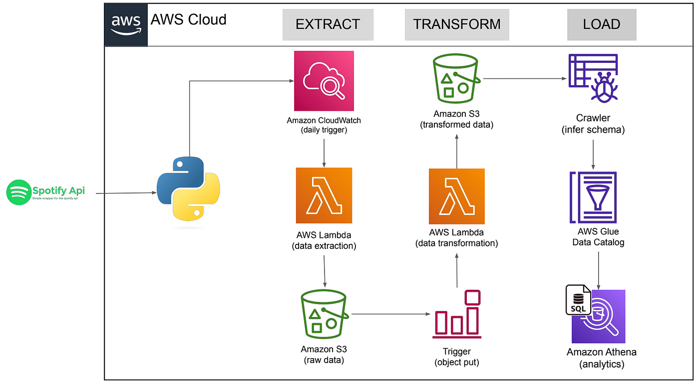

# Data Pipeline Project Using Spotify API

This project demonstrates building a full ETL (Extract, Transform, Load) data pipeline that integrates with the Spotify API, extracts data, performs transformations, and sets up an analytics-ready environment using various AWS services like Lambda, S3, Glue, and Athena.

## Table of Contents
- [Project Overview](#project-overview)
- [Architecture](#architecture)
- [Steps Involved](#steps-involved)
  1. [Spotify API Integration and Data Extraction](#1-spotify-api-integration-and-data-extraction)
  2. [AWS Lambda Deployment for Data Extraction](#2-aws-lambda-deployment-for-data-extraction)
  3. [Automated Trigger Setup for Data Extraction](#3-automated-trigger-setup-for-data-extraction)
  4. [Data Transformation Function](#4-data-transformation-function)
  5. [Automated Trigger for Data Transformation](#5-automated-trigger-for-data-transformation)
  6. [Data Storage on AWS S3](#6-data-storage-on-aws-s3)
  7. [Analytics Table Construction Using AWS Glue and Athena](#7-analytics-table-construction-using-aws-glue-and-athena)
- [Technologies Used](#technologies-used)

## Project Overview

This project involves constructing a serverless data pipeline that extracts data from Spotify using its API, transforms the data, and sets up automated analytics tables using AWS services like S3, Glue, and Athena.

## Architecture

The ETL pipeline architecture follows the classic **Extract, Transform, Load (ETL)** process. Below is a high-level architecture diagram of the pipeline:

- **Extract**: Data is pulled from the Spotify API, triggered daily by Amazon CloudWatch and extracted by an AWS Lambda function.
- **Transform**: Data is transformed using another AWS Lambda function and stored in an organized format on Amazon S3.
- **Load**: AWS Glue crawls the data stored on S3 to infer the schema, catalog it, and make it available for querying with Amazon Athena.

## Steps Involved

### 1. Spotify API Integration and Data Extraction
- **Description**: Connect to the Spotify API to extract data such as song metadata, playlists, and user interactions.
- **Objective**: Automate the data extraction process using AWS Lambda.

### 2. AWS Lambda Deployment for Data Extraction
- **Description**: Develop and deploy a serverless AWS Lambda function that retrieves data from the Spotify API.
- **Objective**: Enable efficient, scalable data extraction in a serverless environment.

### 3. Automated Trigger Setup for Data Extraction
- **Description**: Set up a daily trigger using Amazon CloudWatch or EventBridge to initiate the Lambda function.
- **Objective**: Ensure that data extraction occurs automatically on a scheduled basis.

### 4. Data Transformation Function
- **Description**: Write a Lambda function to transform and clean the extracted data for further processing.
- **Objective**: Normalize and structure the data for ease of use.

### 5. Automated Trigger for Data Transformation
- **Description**: Use an S3 event trigger to run the data transformation Lambda function once the raw data is stored in S3.
- **Objective**: Automate the transformation process post-extraction.

### 6. Data Storage on AWS S3
- **Description**: Store both the raw and transformed data in Amazon S3, organizing it for accessibility and analysis.
- **Objective**: Set up a data lake on S3 for efficient storage and retrieval.

### 7. Analytics Table Construction Using AWS Glue and Athena
- **Description**: Set up AWS Glue crawlers to infer the schema from the transformed data and catalog it. Query the data using Amazon Athena for analysis.
- **Objective**: Enable SQL-based querying of the data for analysis using Athena.

## Technologies Used
- **Spotify API**: Data source for extraction.
- **AWS Lambda**: For both data extraction and transformation functions.
- **Amazon CloudWatch**: To automate triggers for scheduled tasks.
- **Amazon S3**: For storing raw and processed data.
- **AWS Glue**: For building data catalogs and crawling data files.
- **Amazon Athena**: For querying and analyzing the stored data.

---

This project exemplifies the use of AWS serverless technologies to automate the end-to-end data pipeline from extraction to analysis.
